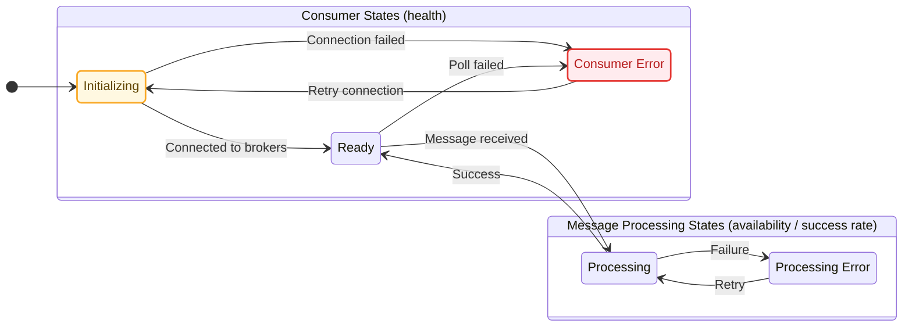

## What to Monitor

For consumers, the core signals are similar to API observability:

1. Health: whether consumers are connected to brokers and ready to consume messages.
2. Availability: the success rate of message processing
3. Latency: how long a message waits before a consumer picks it up, and how long processing takes.

## How to Monitor

### Consumer and Message Processing States

Broker implementations differ, but consumer behavior usually follows the states below.



### Health

For consumer health, focus on consumer states (not message processing states) from the diagram above. Message processing errors are similar to API 500s: they are specific to individual messages and business logic, not the consumer runtime health itself.

To monitor this, report consumer state through metrics. Since there is no universal consumer interface, this usually requires small changes in the main consumer loop. For example:

```python
def consumerLoop(config):
    consumer = null
    consumerUp = createGauge("consumer_up", attributes={
        "consumer_group_name": config.consumerGroupName,
        "topic_name": config.topicName,
    })

    # consumer initialization loop
    while true:
        consumerUp.set(0)
        try:
            consumer = connectToBroker(config.servers, config.consumerGroupName)
            consumer.subscribe(config.topicName)
            # consumer initialization succeeded
            consumerUp.set(1)
        except ConsumerException:
            # consumer initialization failed, keep retrying
            consumerUp.set(0)
            continue

        # message processing loop
        while true:
            try:
                message = consumer.poll(timeoutSeconds=1)
                # poll succeeded
                consumerUp.set(1)
            except ConsumerException:
                # poll failed, break the message processing loop
                # to retry consumer initialization
                consumerUp.set(0)
                break

            ok = processMessageWithRetries(message)
            if ok
                consumer.commit(message)
        # end of message processing loop

    # end of consumer initialization loop
```

You can also replace the `consumer_up` gauge with a custom in-memory state store and expose an API for probes to query consumer state.

For Kafka consumers, many libraries (especially clients built on `librdkafka`) already have background threads handling consumer state. In those cases, you can integrate with the statistics handler callback and report metrics from there.

Example 30-day health SLI:

```text
sum_over_time((consumer_up{consumer_group="example"} or vector(0))[30d:1m]) /
count_over_time((consumer_up{consumer_group="example"} or vector(0))[30d:1m])
```

Use `or vector(0)` because metrics are not reported when the service is fully down, and we want to treat no data as failure. Use fixed resolution `1m` so `vector(0)` is counted in the denominator correctly.

If you use probing instead of push/pull service metrics, you can avoid that issue. Example SLI:

```text
sum_over_time(probe_success{name="example-consumer"}[30d]) /
count_over_time(probe_success{name="example-consumer"}[30d])
```

### Availability and Processing Duration

Beyond consumer health, we also care whether most messages are processed successfully and how long processing takes.

This also requires code changes in your message-processing function, similar to other manual duration instrumentation. For example:

```python
consumerProcessMessageDuration = createHistogram(
    "consumer_process_message_duration",
    attributes={
        "consumer_group": config.consumerGroup,
        "topic": config.topic,
    }

)
def processMessageWithRetries(message):
    startTime = time.now()
    status = "ok"

    for i in range(maxAttempts):
        try:
            messageProcessor.process(message)
            break
        except Exception:
            if i < maxAttempts-1
                # retry
                continue
            # retry exhausted
            status = "error"
            saveToDLQ(message)

    consumerProcessMessageDuration.record(
        time.now() - startTime,
        attributes={"status": status}
    )
    return status == "ok"
```

This histogram gives you both success/failure counts and processing durations.

Example 30-day availability SLI:

```text
sum(rate(consumer_process_message_duration_count{status="ok"}[30d])) /
sum(rate(consumer_process_message_duration_count[30d]))
```

### Consumer Lag

In the section above, we instrumented message processing duration. Another important part of latency is pickup delay: how long it takes for a message to be picked up by consumers.

For example, if incoming traffic suddenly bursts beyond consumer capacity, some messages stay in the topic/queue much longer than usual, causing user-visible delay.

Depending on broker capabilities, there are two lag types:

- time lag (age of oldest message): how long the oldest message has stayed in the queue.
- offset lag: how many messages are in the queue backlog.

Time lag is preferred over offset lag for alerting and SLO discussions because it maps more directly to user experience. A 1-hour time lag means users are seeing a 1-hour delay, while a large offset lag does not necessarily mean large delay.

#### Consumer Lag Metrics

Consumer lag metrics are usually available on the broker side.

For AWS SQS, the gauge [ApproximateAgeOfOldestMessage](https://docs.aws.amazon.com/AWSSimpleQueueService/latest/SQSDeveloperGuide/sqs-available-cloudwatch-metrics.html#:~:text=ApproximateAgeOfOldestMessage) provides this value in seconds.

For Kafka, consumer offset lag is usually available, but time lag (age of oldest message) usually is not. For example, AWS MSK exposes [MaxOffsetLag and SumOffsetLag metrics](https://docs.aws.amazon.com/msk/latest/developerguide/consumer-lag.html).

`EstimatedTimeLag` is not recommended. It is not the age of the oldest message; it estimates backlog drain time, roughly `number of messages in backlog / current consumption rate`. That does not represent real user-facing delay. Also, AWS implements this metric as `0` when consumption rate is `0`, which is not aligned with the metric meaning.

#### SLO and Alerting Considerations

Neither time lag nor offset lag is ideal for defining SLOs: both are not distribution-aware and only capture worst values, while SLOs are usually percentile-based (for example, 95% of message time lag should be < 15 minutes).

Consumer lag is still a useful alerting signal because very large lag is usually caused by failures and usually has real user impact.

Common alerts are typically fixed-threshold based, and thresholds should be tuned to real traffic patterns. For example:

- alert if consumer group age of oldest message > 1 hour
- alert if consumer group sum offset lag > 10000


