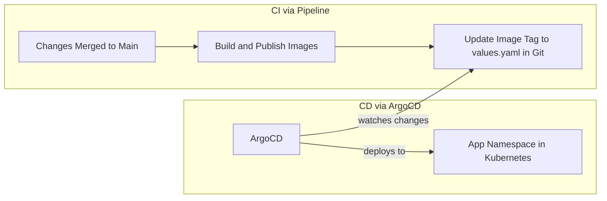
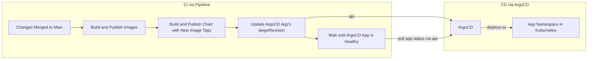
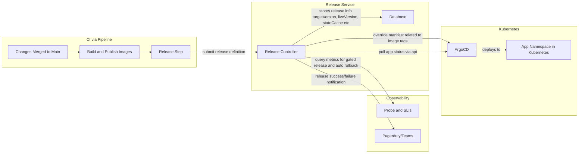

## 1. Simple GitOps: ArgoCD + CI Updating `values.yaml`

This is the typical pattern you will learn from argocd official docs and most of the GitOps articles. Typically you will need to create an argocd app that points to a git repo containing your helm chart and values file. In this setup both k8s resources and app versions are managed in git.

```yaml
apiVersion: argoproj.io/v1alpha1
kind: Application
metadata:
  name: my-service-dev
  namespace: argocd
spec:
  project: default
  source:
    repoURL: https://github.com/my-org/my-helm-repo
    path: charts/my-service-chart
    targetRevision: main
    helm:
      valueFiles:
        - values.yaml
        - values-dev.yaml
  destination:
    namespace: my-service
    server: "https://kubernetes.default.svc"
  syncPolicy:
    automated:
      prune: true
      selfHeal: true
```



### Why It Works Initially

- Aligns well with GitOps principles because Git is the source of truth
- Easy to understand and implement
- Requires minimal tooling

### Problems at Scale

- Hard to standardize because different Helm charts use different value structures
- Configuration especially versions are scattered across many repos and paths
- Automation becomes fragile because CI must understand chart-specific YAML structures
- Deployment visibility is limited:
  - Git only shows desired state
  - It does not show whether Argo CD synced successfully
  - It does not show whether the application is healthy in Kubernetes

## 2. Treating Release as a Helm Chart Version

To solve the above problem, we need to have an app version storage and an api to update the versions, where the api can also be used to retrieve the current version and release status.

Since ArgoCD already manage a list of apps we can utilize the ArgoCD's storage and api there. For example,

```yaml
apiVersion: argoproj.io/v1alpha1
kind: Application
metadata:
  name: my-service-dev
  namespace: argocd
spec:
  project: default
  source:
    repoURL: oci://ghcr.io/my-org/helm-charts
    chart: my-chart
    targetRevision: "1.2.3"
  destination:
    server: https://kubernetes.default.svc
    namespace: my-service
  syncPolicy:
    automated:
      prune: true
      selfHeal: true
```

Now, we need to not define this argocd app using GitOps because we want to call ArgoCD api to dynamically update the `targetRevision` to release a new version via the CICD pipeline.



### Why It Seems Attractive

- Centralized versioning through chart versions
- Immutable artifacts in the OCI registry
- Cleaner separation between build and deploy
- Being able to know when the deploy succeeds, this enables
  - alert when deployment fails
  - running following pipelines like e2e tests

### Where It Breaks Down

- Chart version is not the same as application version, which can be confusing
  - While it's easy to retrieve chart versions, it's still hard to associate the image tags given a chart version
  - People need to trigger deployment or rollback based on chart versions which they may find it difficult to confirm the application version
- The chart is less reusable, it can cause overwhelm the helm registry with many charts which only contains image tag changes
- It's still not a centralized view if the pattern is each k8s cluster has it's own argocd instance

### Helm Chart Libraries

This release model is suitable for library charts. For example, if we have a general use helm chart to deploy a service into Kubernetes where the application resource requests, versions, configs, secrets can all be defined as values. But there will be no CD as users will decide whether to upgrade the chart version to get new features.

## 3. Introducing a Centralized Release Service

Because ArgoCD and helm chart versioning itself may not be the best to define the application release intent and manage the application versioning. And there is also not many popular opensourced service that addresses the above concern. The thing we can do is to build a custom centralized release service.

The release service simply does 2 things

1. have an api to allow submission of a release intent of an application
2. have an api to retrieve the current versions and release status of an application

The api provides an abstraction layer so that the deployment implementation is hidden and can vary or change over time and people can use the api consistently.

The release intent would be something like

```yaml
destination:
  type: kubernetes
  kubernetes:
    cluster: my-service-cluster-name
    argocd-app: my-service-app
    versionOverrides:
      my-service-api: deployments.api.image.tag
      my-service-cronjob: deployments.api.image.tag

targetVersions:
  my-service-api: 1.2.3
  my-service-cronjob: 1.2.3
```

Then the release service can simply apply the target version as values override to the argocd app and let argocd executes the rest.




The above approach only works for version changes, but it's common to have some config changes together with the application version change.

Of course, the release service can take a larger scope and completely replaces argocd. The release service needs to have a application deployment registry which contains a more comprehensive abstraction of the application deployment metadata, then generates the k8s manifest by itself. This removes the need of the hacky value overrides as well. For example,

```yaml
destination:
  type: kubernetes
  kubernetes:
    cluster: my-service-cluster-name
    namespace: my-service-app

my-service-api:
  image: ...
  version: 1.2.3
  config:
    OTEL_METRICS_ENABLED: true
  secrets:
    database:
      type: vault
      vault:
        namespace: cba/my-service
        kv: app/dev/database
        version: v1
      envMapping:
        DATABASE_HOST: .host
        DATABASE_PASSWORD: .password
  # we can let users to provide a helm chart to define the rest of the k8s resources
  # that are not related to common deployment primitives
  chart:
    repo: my-chart-repo
    name: my-service-chart
    version: 0.1.0

my-service-cronjob:
  # similar ....
```

Now the release intent just become a patch file of the service metadata while it remains descriptive.

```yaml
my-service-api:
  version: 1.2.4
  config:
    OTEL_METRICS_ENABLED: false
  secrets:
    database:
      vault:
        version: v2
```

### Why This Works Better

- Standardized interface across teams, much easier integration
- Centralized visibility into:
  - Desired version
  - Deployed version
  - Deployment status
- Decouples concerns:
  - Helm handles packaging
  - ArgoCD or the release service handles execution
- More features can be built into it, e.g.
  - showing a plan before execution
  - gated release and auto rollback base on metrics

### Why Argo Rollouts Won't Solve the Problem

Argo Rollouts is useful when the problem is rollout strategy. It helps with canary, blue-green, traffic shifting, and automated rollback based on runtime signals. Those are important capabilities, but they solve a different problem from the one described here.

The gap in this post is not mainly about how to deploy a version safely. It is about how to define release intent, separate application versions from infrastructure concerns, provide a stable release API, and track release state across teams and environments. Argo Rollouts chooses to add the features directly to kubernetes deployment resource and does not provide that abstraction layer.

## Key Insights

- GitOps alone does not solve release orchestration at scale
- Helm charts are not a reliable abstraction for version management
- The missing layer is a standardized application release and orchestration model above Helm and ArgoCD
